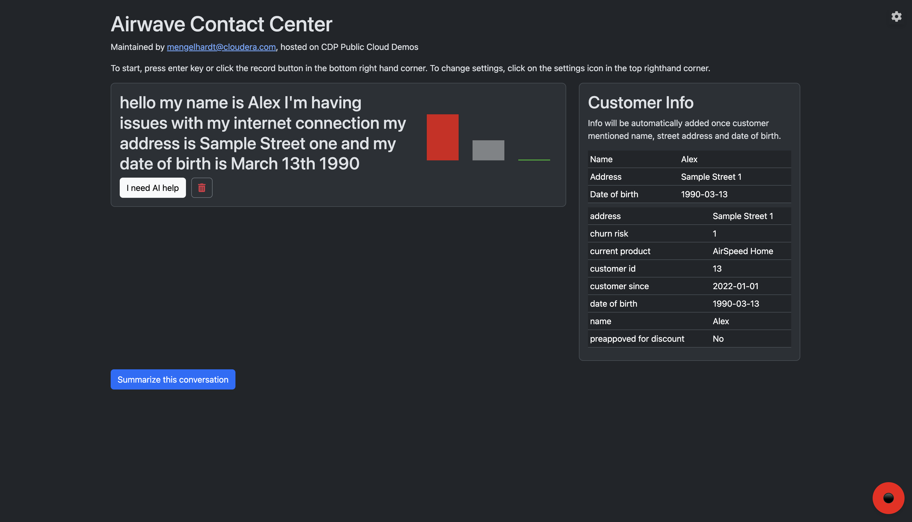

# Telco Call Center AI Demo on Cloudera Machine Learning.

## Description
The Telco Call Center AI Demo is a demonstration project designed to showcase the capabilities of Cloudera Machine Learning (CML) in a fictional telecommunications call center environment. It integrates AI models to enhance customer service by retrieving customer information and assessing churn risk. The project is set up using Cloudera Accelerated Machine Learning Projects (AMPs) and involves deploying a prototype, configuring environment variables, and accessing a web application. The application includes endpoints for sentiment analysis and LLM integration, and it uses a Flask-based frontend for user interaction. The project is configured through a .project-metadata.yaml file, which specifies deployment details and resource allocations.

## Features
- Integration with Spark Data Lake for loading demo data.
- Integration with Impala Data Warehouse for retrieving demo data.
- LLM model integration for customer information retrieval.
- Flask web application for user interaction via speech to text.

## Required Data Connections

- Existing Impala Virtual Warehouse and Data Connection.
- Existing Spark Data Lake connection.

## Installation
To set up the Telco Call Center AI Demo using Cloudera Accelerated Machine Learning Projects (AMPs), follow these steps:

1. **Deploy the AMP:**
    - Navigate to your Cloudera Machine Learning workspace and visit "Deploy a Prototype".
    - Search for and select the "Telco Call Center AI Demo" AMP.
    - If you can't find it, deploy it from the GitHub URL: https://github.com/cloudera-cemea/telco-call-center-ai-demo
    - Follow the on-screen instructions to deploy the project. This will automatically configure the environment and set up the necessary resources as specified in the `project-metadata.yaml`.

2. **Configure Environment Variables:**
    - `SPARK_DATA_LAKE_CONNECTION`: Name of Spark Data Lake connection for loading demo data (default: `go01-aw-dl`). If you are not sure, contact the administrator of the workspace. Required.
    - `IMPALA_DATA_CONNECTION`: Name of the data connection to Impala Virtual Warehouse for demo data retrieval (default: `default-impala-aws`). If you are not sure, contact the administrator of the workspace. Required.
    - `WORKLOAD_PASSWORD`: Password for the Cloudera user deploying the project. Required.
    - `OPENAI_API_KEY`: API key for OpenAI model access. Required.
    - `DEMO_DATABASE_NAME`: Name of the database for demo data (default: `telco_call_center_ai`). Optional.
    - `DEMO_TABLE_NAME`: Name of the table for demo data (default: `customer_info`). Optional.

3. **Wait for the AMP deployment process to finish:**
    - The deployment process will take a few minutes to complete. You can monitor the progress in the Cloudera Machine Learning workspace. The following assets will be deployed during the process:
        - Setup of demo data.
        - Model endpoint for sentiment analysis.
        - Model endpoint for LLM integration and customer information retrieval.
        - Frontend aplication for user interaction with web speech API and model endpoints.

4. **Access the application in your web browser:**
    - Once the deployment is complete, you can access the application by navigating to the URL provided in the Cloudera Machine Learning workspace. The frontend application will be accessible under Applications.
    - Use the interface to input customer details and retrieve information using the AI model.

### Demo Data

The Telco Call Center AI Demo loads demo data from a CSV file to facilitate testing and demonstration. This process is managed by the `data.py` script, which interacts with the Spark Data Lake to ensure the necessary data is available for the application.

#### Loading Demo Data

Upon deployment, the `data.py` script checks for the existence of demo data in the specified database and table. If the data is not found, the script will automatically create it by reading from the `data.csv` file in this directory.

#### Modifying Demo Data

The demo data can be easily modified before deploying the project by editing the `data.csv` file. This allows for customization of the dataset to better suit specific demonstration needs or to test different scenarios. Simply update the contents of `data.csv` with the desired data, and the `data.py` script will handle the rest during the deployment process.

#### Retrieving Demo Data

After the project has been deployed and the application has started, the customer data can be retrieved by speaking/recording name, address, and date of birth via the recording button. If the mentioned details match an entry in the demo data backend, the application will display the corresponding additional customer information, including churn risk, current product and whether the customer is preapproved for discount. For example:

## Contributing
We welcome contributions! Please fork the repository and open a pull request.

## Contact Information
For questions or support, please contact the maintainer at mengelhardt@cloudera.com.
